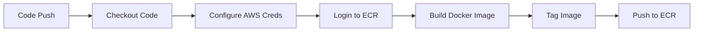

# LAMP Stack Application (PHP)


This repository contains the PHP application code for a LAMP (Linux, Apache, MySQL, PHP) stack that is automatically built and deployed using GitHub Actions to AWS ECR.


## Infrastructure Provisioning

**For complete infrastructure setup including Terraform modules, networking, and deployment automation, see:**  
[AWS LAMP Stack Infrastructure Repository](https://github.com/guderian120/lamp_stack_infranstructure)


Note: All infrastructure is managed through Terraform in the linked repository above.


## 📦 Features

- Simple PHP application structure
- Dockerized deployment
- Automated CI/CD pipeline with GitHub Actions
- Secure image pushes to AWS ECR
- Versioned container images
- Infrastructure-as-code ready

## 🚀 Deployment Pipeline

The application uses GitHub Actions to automatically:

1. Build Docker image on code changes
2. Push images to AWS ECR with:
   - `latest` tag
   - Git commit SHA as version tag
3. Integrates with AWS using IAM roles

### Pipeline Workflow



## 🛠️ Development Setup

### Prerequisites

- Docker installed locally
- AWS account with ECR repository
- IAM role configured for GitHub Actions

### Local Development

1. Clone the repository:
   ```bash
   git clone https://github.com/guderian120/lamp_stack_application.git
   cd lamp_stack_application
   ```

2. Build the Docker image locally:
   ```bash
   docker build -t lampstack .
   ```

3. Run the container:
   ```bash
   docker run -p 80:80 lampstack
   ```

4. Access the application at `http://localhost`

## 🔄 CI/CD Configuration

The GitHub Actions workflow is configured in `.github/workflows/ecr-push.yml` and requires:

1. AWS IAM role with ECR push permissions
2. Repository secrets for AWS integration
3. ECR repository named `lampstack` in eu-west-1

### Environment Variables

| Variable | Description |
|----------|-------------|
| `AWS_REGION` | AWS region (eu-west-1) |
| `ECR_REPOSITORY` | ECR repository name |
| `CONTAINER_NAME` | Docker container name |
| `ECR_REGISTRY` | Full ECR registry URL |

## 📂 Project Structure

```
.
├── LAMP_STACK_PHP_CODE/      # PHP application code
│   ├── index.php  
|   ├── Dockerfile          # Docker configuration
│   └── ...                  # Other PHP files
├                
├── .github/
│   └── workflows/
│       └── deploy.yml     # CI/CD pipeline
└── README.md                # This file
```
