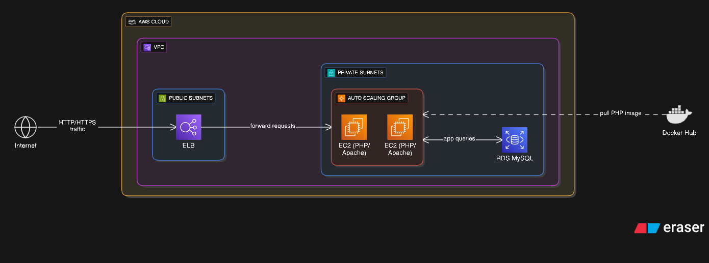

# LAMP Stack Application on AWS

## Overview
This project is a LAMP (Linux, Apache, MySQL, PHP) stack application deployed on Amazon Web Services (AWS). The application is containerized using a PHP Docker image, hosted on Docker Hub, and runs on EC2 instances within an auto-scaling group. The infrastructure is provisioned in a custom Virtual Private Cloud (VPC) with public and private subnets across two Availability Zones (AZs) for high availability. An Elastic Load Balancer (ELB) routes traffic to the application, and Amazon RDS (MySQL) serves as the database backend.

## Architecture
The application is deployed with the following AWS components:


- **VPC**: A custom Virtual Private Cloud with:
  - **Four Subnets**: Two public subnets and two private subnets, distributed across two Availability Zones (AZs) for redundancy.
- **Auto Scaling Group (ASG)**: 
  - Deploys EC2 instances in the private subnets.
  - Uses a launch template with a user data script to install Apache HTTP Server (httpd) and configure the environment.
- **Elastic Load Balancer (ELB)**: 
  - Front-facing load balancer in the public subnets.
  - Routes incoming traffic to EC2 instances in the private subnets.
- **RDS MySQL**: 
  - A managed MySQL database instance for persistent storage.
  - Deployed in the private subnets for security.
- **Docker**: 
  - Pulls a custom PHP application image from Docker Hub.
  - The image contains the PHP codebase and dependencies.

### Diagram
```plaintext
+-------------------+
|   Internet        |
+-------------------+
         |
         v
+-------------------+
| Elastic Load Balancer (Public Subnets) |
+-------------------+
         |
         v
+-------------------+
| Auto Scaling Group (Private Subnets) |
|   EC2 Instances (Apache + PHP)       |
|   Pulls PHP Docker Image             |
+-------------------+
         |
         v
+-------------------+
| RDS MySQL (Private Subnets) |
+-------------------+
```

## Prerequisites
- AWS account with permissions to create VPC, EC2, ELB, RDS, and Auto Scaling resources.
- Docker Hub account with the PHP application image uploaded.
- AWS CLI configured with appropriate credentials.
- (Optional) Terraform or CloudFormation for infrastructure as code (IaC).
- Basic knowledge of AWS, Docker, and Linux.

## Setup Instructions

### 1. Create the VPC
1. Log in to the AWS Management Console.
2. Navigate to the VPC service.
3. Create a VPC with a CIDR block (e.g., `10.0.0.0/16`).
4. Create four subnets:
   - Two public subnets (e.g., `10.0.1.0/24`, `10.0.2.0/24`) in different AZs.
   - Two private subnets (e.g., `10.0.3.0/24`, `10.0.4.0/24`) in the same AZs.
5. Configure an Internet Gateway and attach it to the VPC.
6. Update the route table for public subnets to route `0.0.0.0/0` to the Internet Gateway.
7. Create a NAT Gateway in one public subnet and update the private subnets’ route table to route `0.0.0.0/0` to the NAT Gateway.

### 2. Set Up RDS MySQL
1. Navigate to the RDS service in the AWS Console.
2. Create a MySQL database instance:
   - Choose the private subnets for deployment.
   - Configure security groups to allow EC2 instances to connect (port 3306).
3. Note the database endpoint, username, and password for application configuration.

### 3. Create the Launch Template
1. Navigate to the EC2 service.
2. Create a launch template with:
   - **AMI**: Choose an Amazon Linux 2 AMI (or your preferred Linux distribution).
   - **Instance Type**: Select an appropriate instance type (e.g., `t2.micro` for testing).
   - **User Data Script**: Include a script to install Apache, Docker, and pull the PHP Docker image. Example:
     ```bash
     #!/bin/bash
     yum update -y
     yum install -y httpd docker
     service httpd start
     chkconfig httpd on
     service docker start
     docker login -u <DOCKERHUB_USERNAME> -p <DOCKERHUB_PASSWORD>
     docker pull <DOCKERHUB_USERNAME>/<REPO_NAME>:<TAG>
     docker run -d -p 80:80 <DOCKERHUB_USERNAME>/<REPO_NAME>:<TAG>
     ```
3. Configure a security group to allow HTTP (port 80) traffic from the ELB and MySQL (port 3306) traffic to RDS.

### 4. Set Up the Auto Scaling Group
1. Navigate to the EC2 Auto Scaling service.
2. Create an Auto Scaling Group:
   - Use the launch template created above.
   - Deploy instances in the private subnets.
   - Set desired, minimum, and maximum instance counts (e.g., 2, 1, 4).
   - Configure scaling policies (e.g., CPU-based scaling).
3. Attach the Auto Scaling Group to the ELB.

### 5. Configure the Elastic Load Balancer
1. Navigate to the EC2 service and select Load Balancers.
2. Create an Application Load Balancer (ALB):
   - Place it in the public subnets.
   - Configure a listener for HTTP (port 80) to forward traffic to the Auto Scaling Group.
   - Set up a health check (e.g., `/health` endpoint on port 80).
3. Update the security group to allow incoming HTTP traffic (port 80) from the internet.

### 6. Deploy the PHP Application
1. Ensure your PHP application is containerized and pushed to Docker Hub:
   - Example: `docker push <DOCKERHUB_USERNAME>/<REPO_NAME>:<TAG>`
2. Update the application’s configuration to connect to the RDS MySQL instance (e.g., update environment variables or config files with the RDS endpoint, username, and password).
3. The user data script in the launch template will pull and run the Docker image on EC2 instances.

### 7. Test the Deployment
1. Access the ELB’s DNS name (e.g., `http://<elb-dns-name>`) in a browser.
2. Verify the application loads correctly.
3. Test database connectivity by performing operations (e.g., read/write data).
4. Monitor the Auto Scaling Group and ELB health checks via the AWS Console.

## Monitoring and Maintenance
- **CloudWatch**: Set up alarms for CPU usage, ELB latency, and RDS performance.
- **Logs**: Centralize EC2 and Apache logs in CloudWatch Logs.
- **Auto Scaling**: Adjust scaling policies based on traffic patterns.
- **Security**: Regularly update AMIs, Docker images, and RDS instances with security patches.

## Rollback
- If a deployment fails, the Auto Scaling Group can revert to the previous launch template version.
- Use Docker image tags to roll back to a stable version of the PHP application.
- Ensure RDS backups are enabled for database recovery.

## Troubleshooting
- **ELB Issues**: Check health checks and security group rules.
- **EC2 Issues**: Verify user data script execution and Docker container logs.
- **RDS Issues**: Confirm security group allows EC2-to-RDS traffic and check database credentials.
- **Docker Issues**: Ensure Docker Hub credentials are valid and the image is accessible.

